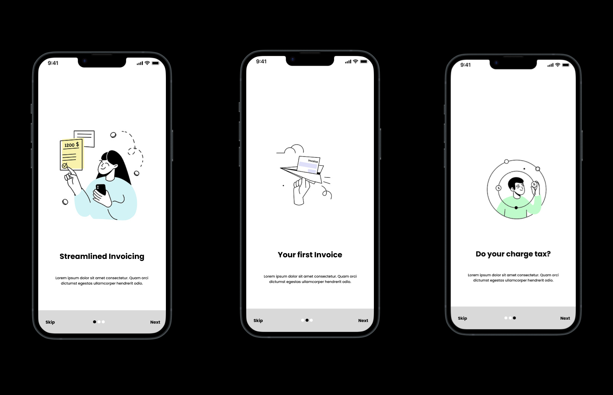

# Mobile Invoice App

The Mobile Invoice App is a mobile application that allows users to generate invoices for a given list of products and export them as PDF documents. With this app, users can easily create professional invoices on the go, making it convenient for small businesses and freelancers.

## Screenshots

## Features

- Create and manage invoices
- Add products to invoices with details such as name, quantity, price, and description
- Calculate total amounts automatically
- Customize invoice templates
- Export invoices as PDF documents
- Email invoices directly from the app

## Installation

To use the Mobile Invoice App, follow these steps:

1. Clone the repository: `git clone https://github.com/your-username/mobile-invoice-app.git`
2. Install dependencies: `npm install`
3. Run the app: `npm start`

## Usage

1. Launch the app on your mobile device.
2. Create a new invoice by entering the necessary details, such as client information and invoice items.
3. Review the invoice and make any necessary adjustments.
4. Export the invoice as a PDF document.
5. Share the PDF document or send it via email to the client.

## Technologies Used

- React Native: a JavaScript framework for building mobile applications
- PDFMake: a library for generating PDF documents
- SQLite: a relational database for storing invoice data
- Redux: a state management library for managing app data

## Contributing

Contributions are welcome! If you find any bugs or have suggestions for new features, please open an issue or submit a pull request. Make sure to follow the coding conventions and provide detailed information in your commits.
